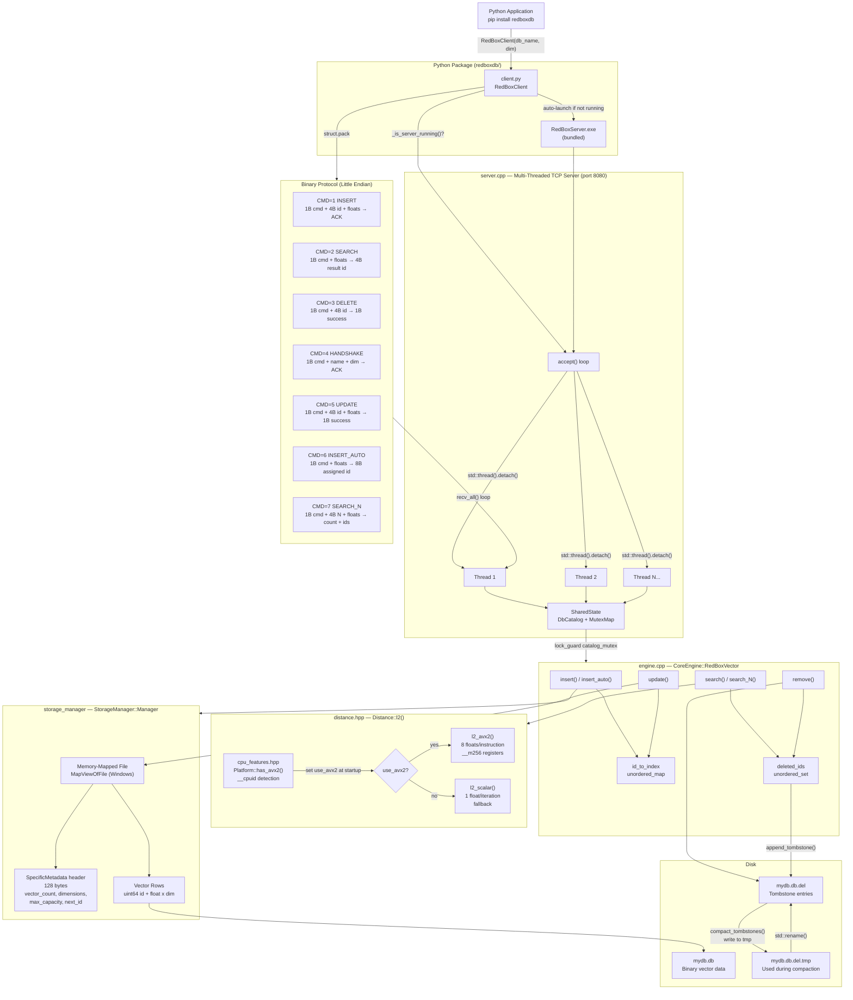

# RedBoxDB Architecture

```mermaid
flowchart TD
    User["Python Application\npip install redboxdb"]

    subgraph PythonLayer["Python Package (redboxdb/)"]
        Client["client.py\nRedBoxClient"]
        Exe["RedBoxServer.exe\n(bundled)"]
    end

    subgraph ServerLayer["server.cpp — Multi-Threaded TCP Server (port 8080)"]
        Accept["accept() loop"]
        T1["Thread 1"]
        T2["Thread 2"]
        T3["Thread N..."]
        SharedState["SharedState\nDbCatalog + MutexMap"]
    end

    subgraph EngineLayer["engine.cpp — CoreEngine::RedBoxVector"]
        Insert["insert() / insert_auto()"]
        Search["search() / search_N()"]
        Remove["remove()"]
        Update["update()"]
        IdxMap["id_to_index\nunordered_map"]
        DelSet["deleted_ids\nunordered_set"]
    end

    subgraph DistanceLayer["distance.hpp — Distance::l2()"]
        Dispatch{"use_avx2?"}
        AVX2["l2_avx2()\n8 floats/instruction\n__m256 registers"]
        Scalar["l2_scalar()\n1 float/iteration\nfallback"]
        CPUCheck["cpu_features.hpp\nPlatform::has_avx2()\n__cpuid detection"]
    end

    subgraph StorageLayer["storage_manager — StorageManager::Manager"]
        MMAP["Memory-Mapped File\nMapViewOfFile (Windows)"]
        Header["SpecificMetadata header\n128 bytes\nvector_count, dimensions,\nmax_capacity, next_id"]
        Rows["Vector Rows\nuint64 id + float x dim"]
    end

    subgraph DiskLayer["Disk"]
        DBFile["mydb.db\nBinary vector data"]
        DelFile["mydb.db.del\nTombstone entries"]
        TmpFile["mydb.db.del.tmp\nUsed during compaction"]
    end

    User -->|"RedBoxClient(db_name, dim)"| Client
    Client -->|"_is_server_running()?"| Accept
    Client -->|"auto-launch if not running"| Exe
    Exe --> Accept

    Accept -->|"std::thread().detach()"| T1
    Accept -->|"std::thread().detach()"| T2
    Accept -->|"std::thread().detach()"| T3

    T1 --> SharedState
    T2 --> SharedState
    T3 --> SharedState

    SharedState -->|"lock_guard catalog_mutex"| EngineLayer

    Insert --> IdxMap
    Insert --> StorageLayer
    Search --> DelSet
    Search --> DistanceLayer
    Remove --> DelSet
    Remove --> DelFile
    Update --> IdxMap
    Update --> MMAP

    Dispatch -->|"yes"| AVX2
    Dispatch -->|"no"| Scalar
    CPUCheck -->|"set use_avx2 at startup"| Dispatch

    MMAP --> Header
    MMAP --> Rows
    Rows --> DBFile

    DelSet -->|"append_tombstone()"| DelFile
    DelFile -->|"compact_tombstones()\nwrite to tmp"| TmpFile
    TmpFile -->|"std::rename()"| DelFile

    subgraph Protocol["Binary Protocol (Little Endian)"]
        P1["CMD=1 INSERT\n1B cmd + 4B id + floats → ACK"]
        P2["CMD=2 SEARCH\n1B cmd + floats → 4B result id"]
        P3["CMD=3 DELETE\n1B cmd + 4B id → 1B success"]
        P4["CMD=4 HANDSHAKE\n1B cmd + name + dim → ACK"]
        P5["CMD=5 UPDATE\n1B cmd + 4B id + floats → 1B success"]
        P6["CMD=6 INSERT_AUTO\n1B cmd + floats → 8B assigned id"]
        P7["CMD=7 SEARCH_N\n1B cmd + 4B N + floats → count + ids"]
    end

    Client -->|"struct.pack"| Protocol
    Protocol -->|"recv_all() loop"| T1
```