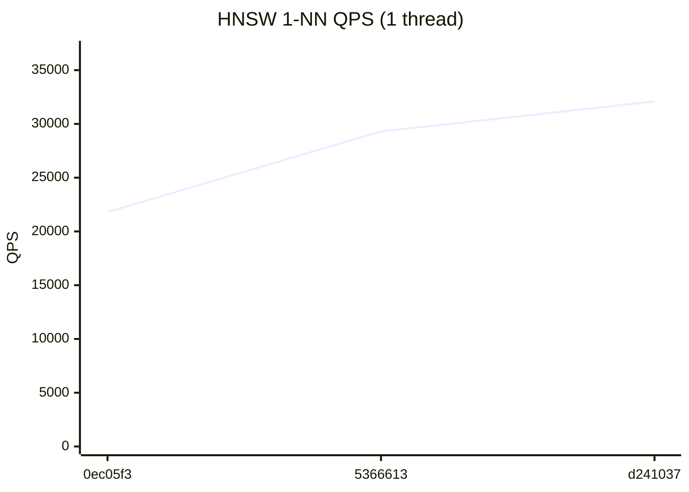
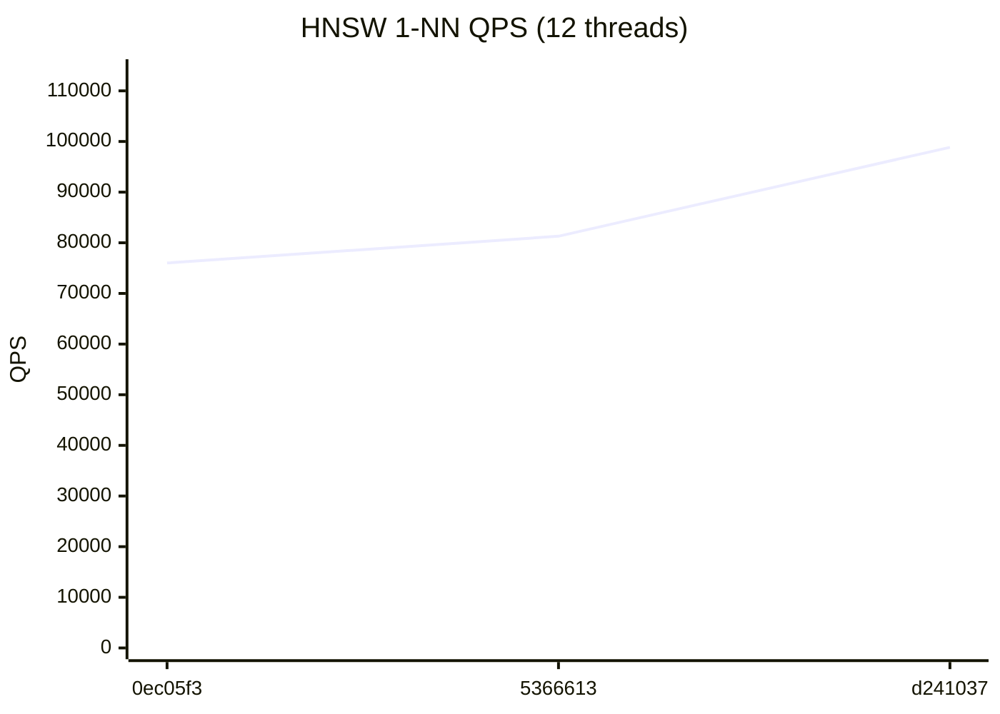
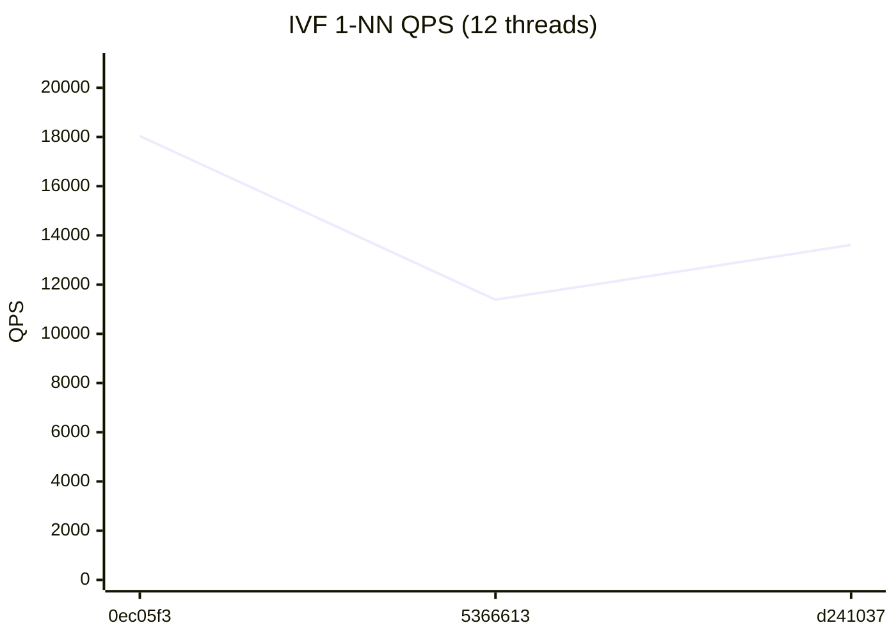

# RedBoxDb Performance Dashboard

> Auto-generated on every commit to main. Last updated: 2026-07-23

## Latest Results (`d241037`)

| Metric | Value | vs Previous |
|--------|-------|-------------|
| HNSW QPS (1T) | 32,089 | +9.5% ↑ |
| HNSW QPS (12T) | 98,852 | +21.6% ↑ |
| IVF QPS (1T) | 5,303 | +4.5% ↑ |
| IVF QPS (12T) | 13,614 | +19.6% ↑ |
| HNSW Insert/sec | 1,911 | +13.3% ↑ |
| IVF Insert/sec | 77,856 | +21.0% ↑ |
| Recall@100 | 86.4% | → |

## HNSW 1-NN QPS (1 thread)



## HNSW 1-NN QPS (12 threads)



## IVF 1-NN QPS (1 thread)


## IVF 1-NN QPS (12 threads)



## Quick Trends

```
         HNSW QPS (1T)        32,089  ▁▆█
        HNSW QPS (12T)        98,852  ▁▂█
          IVF QPS (1T)         5,303  ▁██
         IVF QPS (12T)        13,614  █▁▃
       HNSW Insert/sec         1,911  ▁▆█
        IVF Insert/sec        77,856  ▁▄█
            Recall@100         86.4%  ▁██
```

## Full History

| # | Commit | Date | HNSW 1T | HNSW NT | IVF 1T | IVF NT | HNSW Ins | IVF Ins | Recall |
|---|--------|------|---------|---------|--------|--------|----------|---------|--------|
| 3 | `d241037` | 2026-07-23 | 32,089 | 98,852 | 5,303 | 13,614 | 1,911 | 77,856 | 86.4% |
| 2 | `5366613` | 2026-07-22 | 29,297 | 81,296 | 5,074 | 11,386 | 1,687 | 64,329 | 86.3% |
| 1 | `0ec05f3` | 2026-07-21 | 21,803 | 76,009 | 3,457 | 18,039 | 1,219 | 54,340 | 85.7% |
