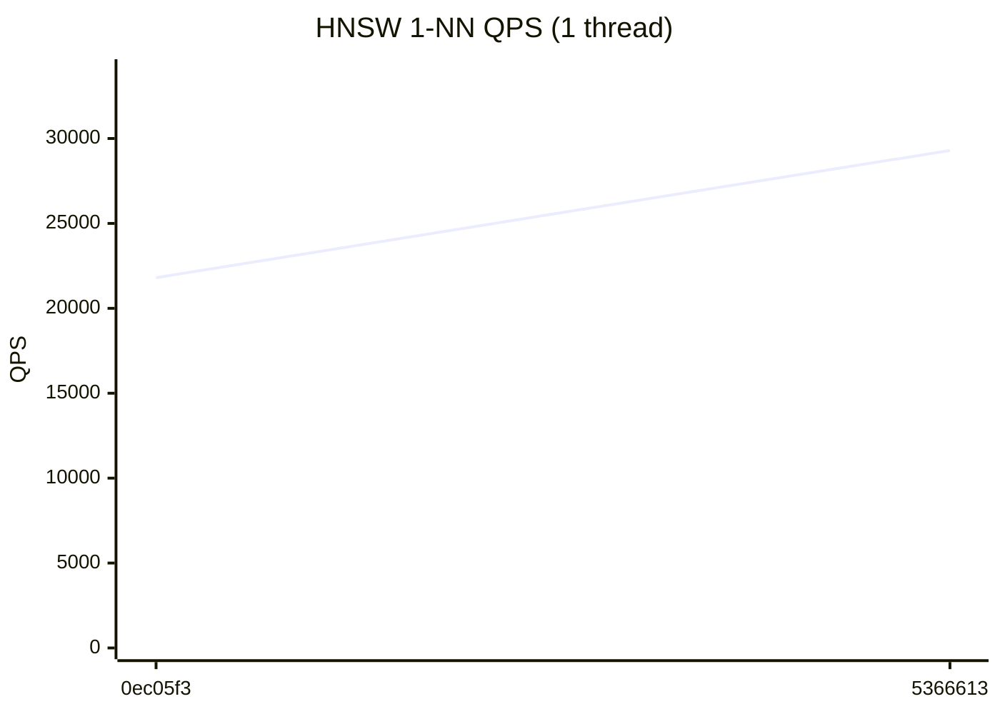
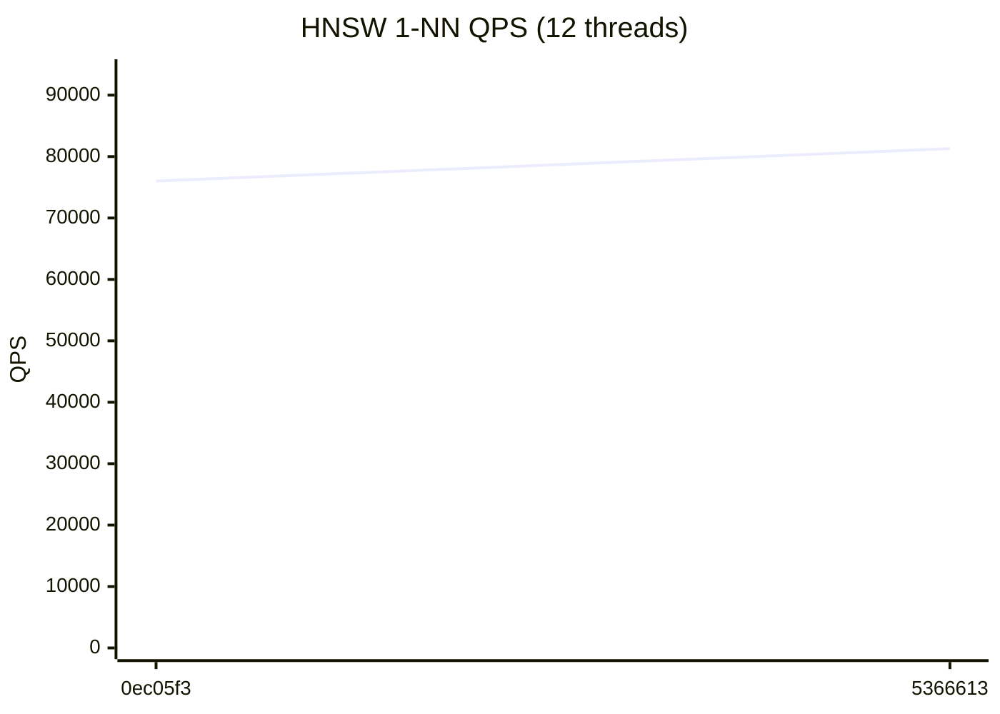
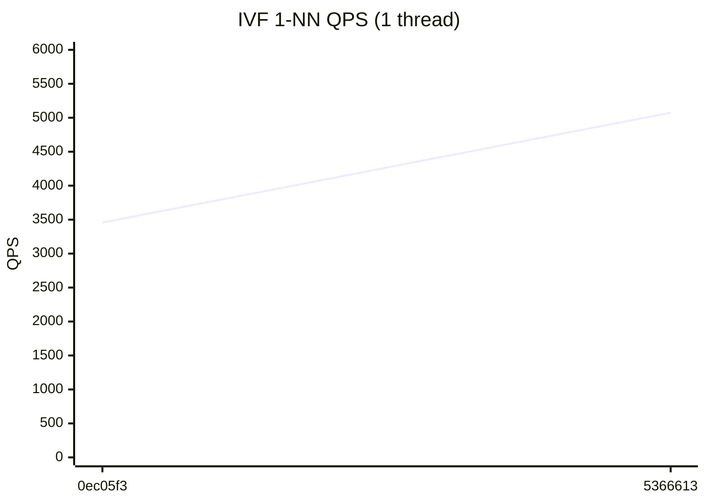
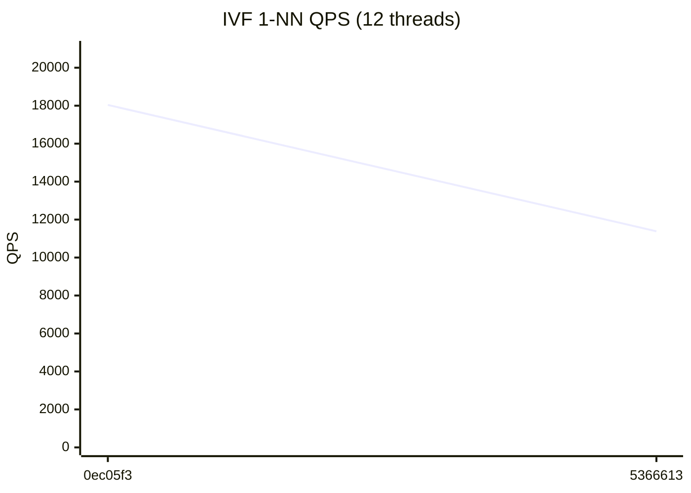

# RedBoxDb Performance Dashboard

> Auto-generated on every commit to main. Last updated: 2026-07-22

## Latest Results (`5366613`)

| Metric | Value | vs Previous |
|--------|-------|-------------|
| HNSW QPS (1T) | 29,297 | +34.4% ↑ |
| HNSW QPS (12T) | 81,296 | +7.0% ↑ |
| IVF QPS (1T) | 5,074 | +46.8% ↑ |
| IVF QPS (12T) | 11,386 | -36.9% ↓ |
| HNSW Insert/sec | 1,687 | +38.4% ↑ |
| IVF Insert/sec | 64,329 | +18.4% ↑ |
| Recall@100 | 86.3% | → |

## HNSW 1-NN QPS (1 thread)



## HNSW 1-NN QPS (12 threads)



## IVF 1-NN QPS (1 thread)



## IVF 1-NN QPS (12 threads)



## Quick Trends

```
         HNSW QPS (1T)        29,297  ▁█
        HNSW QPS (12T)        81,296  ▁█
          IVF QPS (1T)         5,074  ▁█
         IVF QPS (12T)        11,386  █▁
       HNSW Insert/sec         1,687  ▁█
        IVF Insert/sec        64,329  ▁█
            Recall@100         86.3%  ▁█
```

## Full History

| # | Commit | Date | HNSW 1T | HNSW NT | IVF 1T | IVF NT | HNSW Ins | IVF Ins | Recall |
|---|--------|------|---------|---------|--------|--------|----------|---------|--------|
| 2 | `5366613` | 2026-07-22 | 29,297 | 81,296 | 5,074 | 11,386 | 1,687 | 64,329 | 86.3% |
| 1 | `0ec05f3` | 2026-07-21 | 21,803 | 76,009 | 3,457 | 18,039 | 1,219 | 54,340 | 85.7% |
