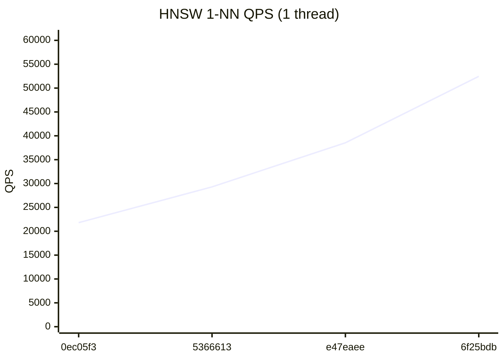
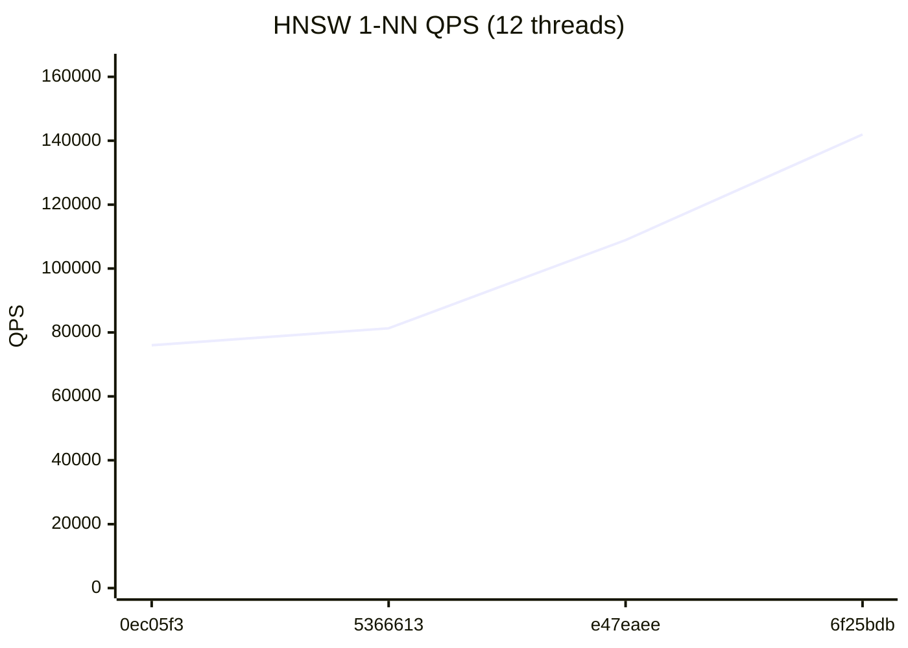
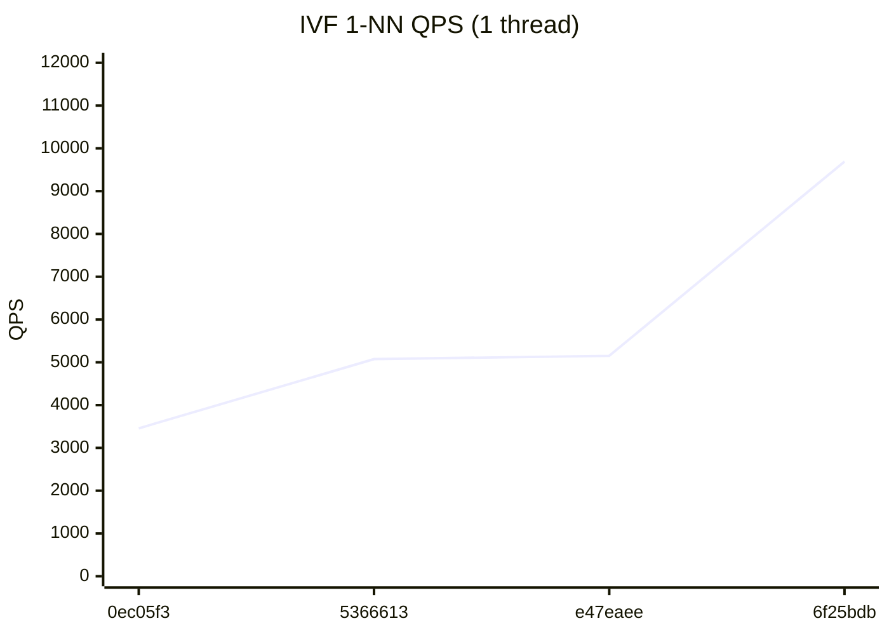
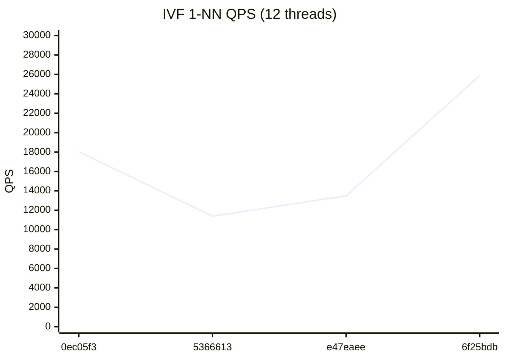

# RedBoxDb Performance Dashboard

> Auto-generated on every commit to main. Last updated: 2026-07-24

## Latest Results (`6f25bdb`)

| Metric | Value | vs Previous |
|--------|-------|-------------|
| HNSW QPS (1T) | 52,456 | +36.1% ↑ |
| HNSW QPS (12T) | 141,960 | +30.4% ↑ |
| IVF QPS (1T) | 9,690 | +88.1% ↑ |
| IVF QPS (12T) | 25,876 | +91.9% ↑ |
| HNSW Insert/sec | 2,231 | +19.1% ↑ |
| IVF Insert/sec | 80,613 | +3.5% ↑ |
| Recall@100 | 86.5% | → |

## HNSW 1-NN QPS (1 thread)



## HNSW 1-NN QPS (12 threads)



## IVF 1-NN QPS (1 thread)



## IVF 1-NN QPS (12 threads)



## Quick Trends

```
         HNSW QPS (1T)        52,456  ▁▂▅█
        HNSW QPS (12T)       141,960  ▁▁▄█
          IVF QPS (1T)         9,690  ▁▃▃█
         IVF QPS (12T)        25,876  ▄▁▂█
       HNSW Insert/sec         2,231  ▁▄▆█
        IVF Insert/sec        80,613  ▁▄██
            Recall@100         86.5%  ▁▅█▆
```

## Full History

| # | Commit | Date | HNSW 1T | HNSW NT | IVF 1T | IVF NT | HNSW Ins | IVF Ins | Recall |
|---|--------|------|---------|---------|--------|--------|----------|---------|--------|
| 4 | `6f25bdb` | 2026-07-24 | 52,456 | 141,960 | 9,690 | 25,876 | 2,231 | 80,613 | 86.5% |
| 3 | `e47eaee` | 2026-07-23 | 38,537 | 108,905 | 5,151 | 13,485 | 1,873 | 77,904 | 86.9% |
| 2 | `5366613` | 2026-07-22 | 29,297 | 81,296 | 5,074 | 11,386 | 1,687 | 64,329 | 86.3% |
| 1 | `0ec05f3` | 2026-07-21 | 21,803 | 76,009 | 3,457 | 18,039 | 1,219 | 54,340 | 85.7% |
