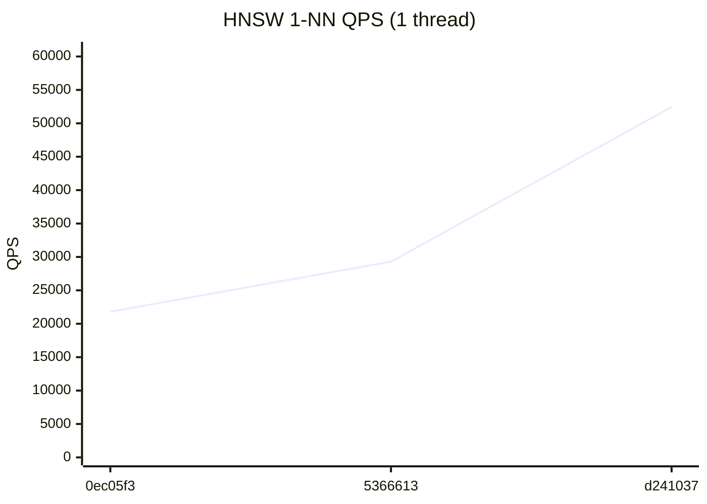
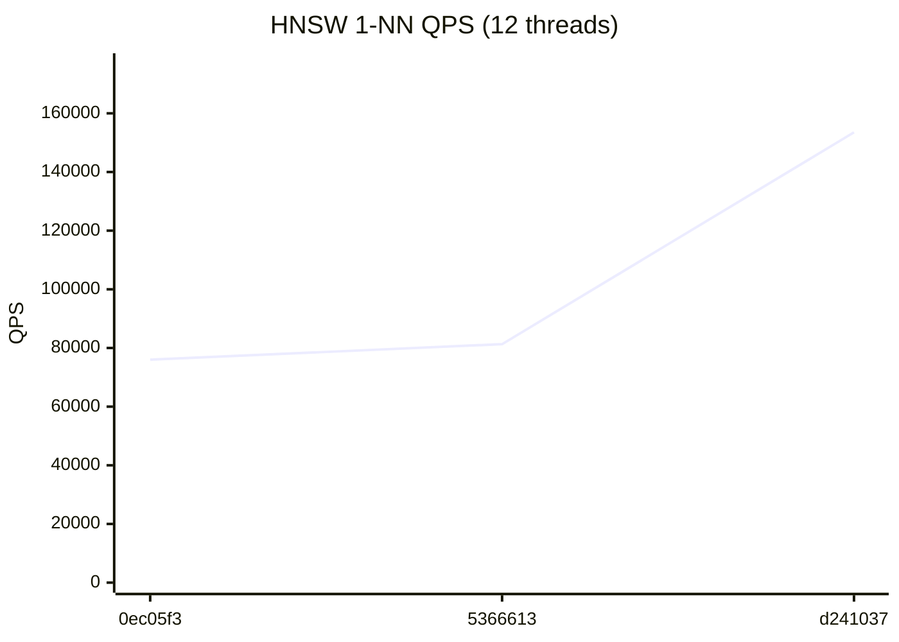
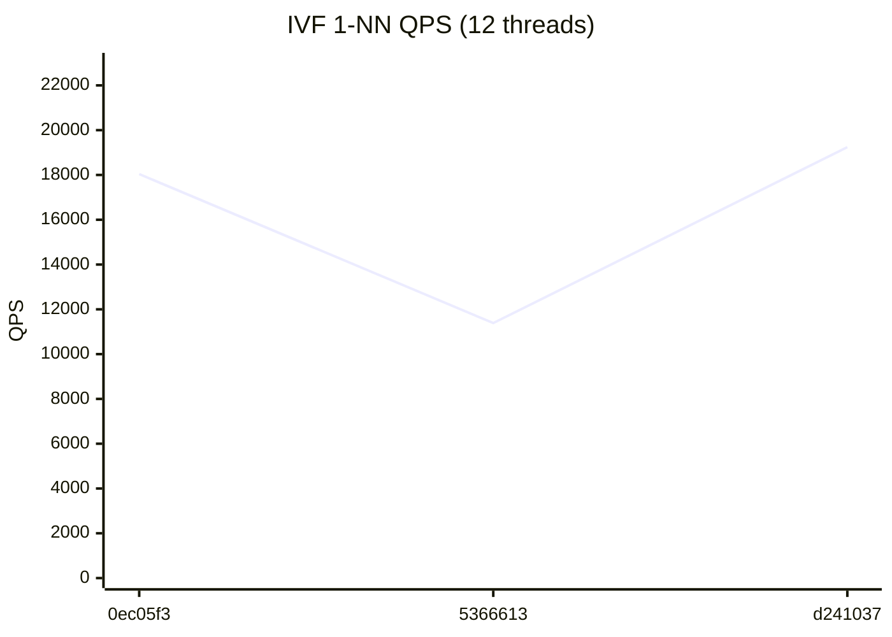

# RedBoxDb Performance Dashboard

> Auto-generated on every commit to main. Last updated: 2026-07-23

## Latest Results (`d241037`)

| Metric | Value | vs Previous |
|--------|-------|-------------|
| HNSW QPS (1T) | 52,450 | +79.0% ↑ |
| HNSW QPS (12T) | 153,516 | +88.8% ↑ |
| IVF QPS (1T) | 7,838 | +54.5% ↑ |
| IVF QPS (12T) | 19,241 | +69.0% ↑ |
| HNSW Insert/sec | 2,552 | +51.3% ↑ |
| IVF Insert/sec | 124,935 | +94.2% ↑ |
| Recall@100 | 86.7% | → |

## HNSW 1-NN QPS (1 thread)



## HNSW 1-NN QPS (12 threads)



## IVF 1-NN QPS (1 thread)


## IVF 1-NN QPS (12 threads)



## Quick Trends

```
         HNSW QPS (1T)        52,450  ▁▂█
        HNSW QPS (12T)       153,516  ▁▁█
          IVF QPS (1T)         7,838  ▁▃█
         IVF QPS (12T)        19,241  ▇▁█
       HNSW Insert/sec         2,552  ▁▃█
        IVF Insert/sec       124,935  ▁▂█
            Recall@100         86.7%  ▁▅█
```

## Full History

| # | Commit | Date | HNSW 1T | HNSW NT | IVF 1T | IVF NT | HNSW Ins | IVF Ins | Recall |
|---|--------|------|---------|---------|--------|--------|----------|---------|--------|
| 3 | `d241037` | 2026-07-23 | 52,450 | 153,516 | 7,838 | 19,241 | 2,552 | 124,935 | 86.7% |
| 2 | `5366613` | 2026-07-22 | 29,297 | 81,296 | 5,074 | 11,386 | 1,687 | 64,329 | 86.3% |
| 1 | `0ec05f3` | 2026-07-21 | 21,803 | 76,009 | 3,457 | 18,039 | 1,219 | 54,340 | 85.7% |
