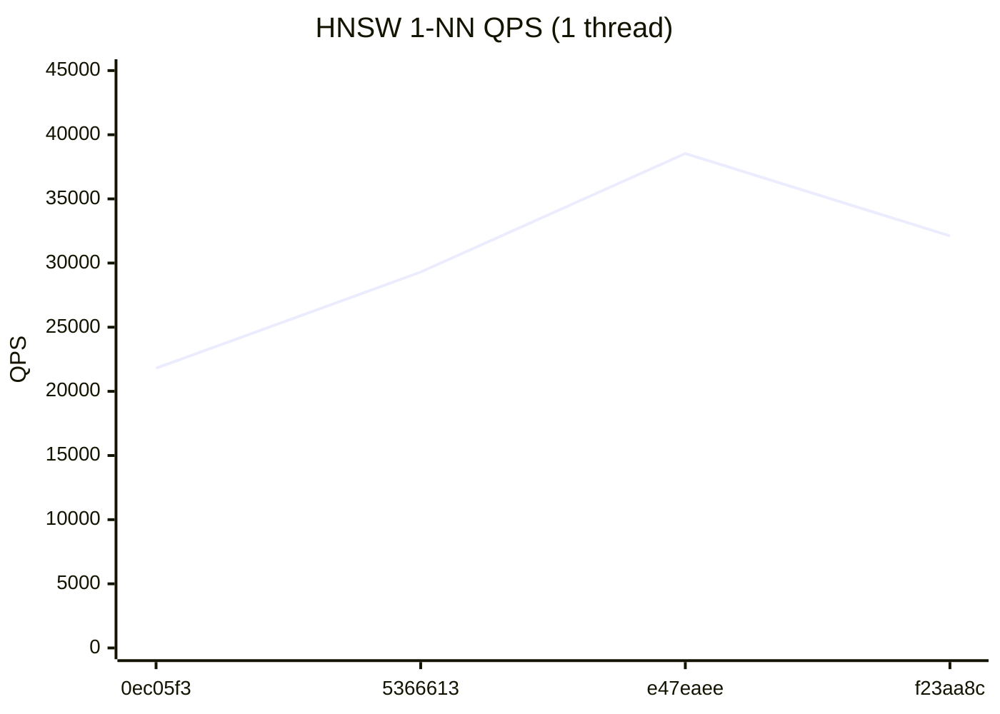
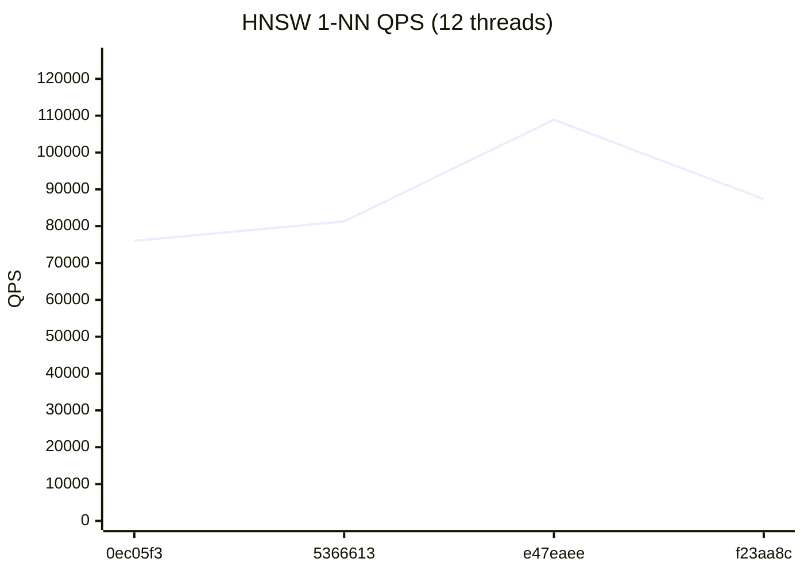
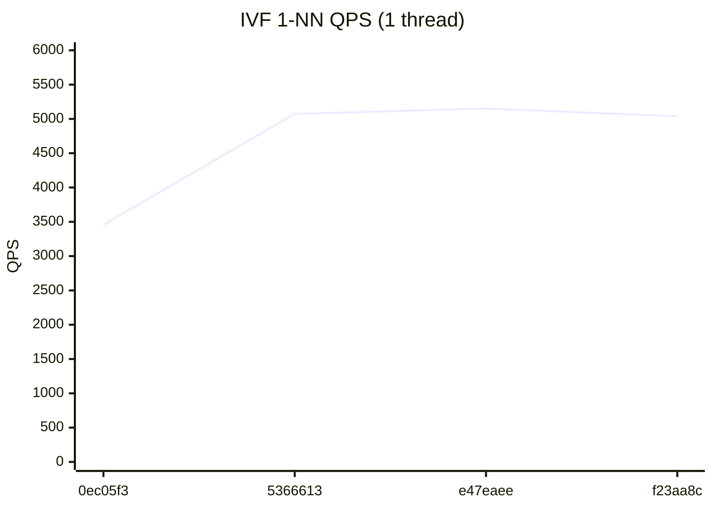

# RedBoxDb Performance Dashboard

> Auto-generated on every commit to main. Last updated: 2026-07-24

## Latest Results (`f23aa8c`)

| Metric | Value | vs Previous |
|--------|-------|-------------|
| HNSW QPS (1T) | 32,113 | -16.7% ↓ |
| HNSW QPS (12T) | 87,335 | -19.8% ↓ |
| IVF QPS (1T) | 5,039 | -2.2% ↓ |
| IVF QPS (12T) | 12,823 | -4.9% ↓ |
| HNSW Insert/sec | 1,852 | -1.1% ↓ |
| IVF Insert/sec | 77,869 | → |
| Recall@100 | 86.3% | → |

## HNSW 1-NN QPS (1 thread)



## HNSW 1-NN QPS (12 threads)



## IVF 1-NN QPS (1 thread)



## IVF 1-NN QPS (12 threads)


## Quick Trends

```
         HNSW QPS (1T)        32,113  ▁▄█▅
        HNSW QPS (12T)        87,335  ▁▂█▃
          IVF QPS (1T)         5,039  ▁███
         IVF QPS (12T)        12,823  █▁▃▂
       HNSW Insert/sec         1,852  ▁▆██
        IVF Insert/sec        77,869  ▁▄██
            Recall@100         86.3%  ▁▅█▅
```

## Full History

| # | Commit | Date | HNSW 1T | HNSW NT | IVF 1T | IVF NT | HNSW Ins | IVF Ins | Recall |
|---|--------|------|---------|---------|--------|--------|----------|---------|--------|
| 4 | `f23aa8c` | 2026-07-24 | 32,113 | 87,335 | 5,039 | 12,823 | 1,852 | 77,869 | 86.3% |
| 3 | `e47eaee` | 2026-07-23 | 38,537 | 108,905 | 5,151 | 13,485 | 1,873 | 77,904 | 86.9% |
| 2 | `5366613` | 2026-07-22 | 29,297 | 81,296 | 5,074 | 11,386 | 1,687 | 64,329 | 86.3% |
| 1 | `0ec05f3` | 2026-07-21 | 21,803 | 76,009 | 3,457 | 18,039 | 1,219 | 54,340 | 85.7% |
