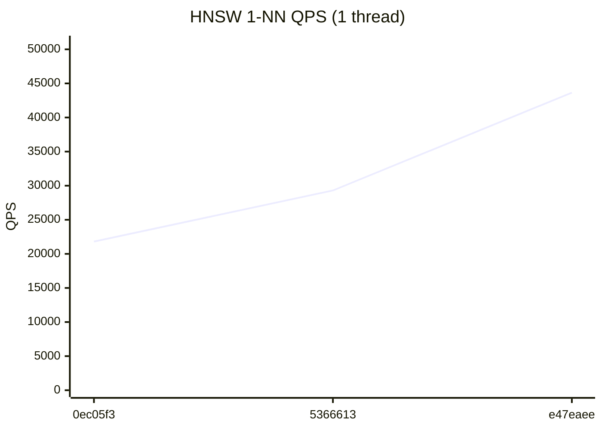
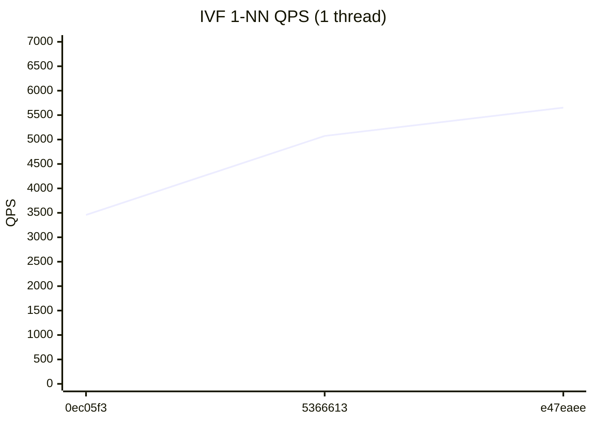

# RedBoxDb Performance Dashboard

> Auto-generated on every commit to main. Last updated: 2026-07-23

## Latest Results (`e47eaee`)

| Metric | Value | vs Previous |
|--------|-------|-------------|
| HNSW QPS (1T) | 43,646 | +49.0% ↑ |
| HNSW QPS (12T) | 105,640 | +29.9% ↑ |
| IVF QPS (1T) | 5,652 | +11.4% ↑ |
| IVF QPS (12T) | 13,665 | +20.0% ↑ |
| HNSW Insert/sec | 2,000 | +18.6% ↑ |
| IVF Insert/sec | 64,739 | → |
| Recall@100 | 86.5% | → |

## HNSW 1-NN QPS (1 thread)



## HNSW 1-NN QPS (12 threads)


## IVF 1-NN QPS (1 thread)



## IVF 1-NN QPS (12 threads)


## Quick Trends

```
         HNSW QPS (1T)        43,646  ▁▃█
        HNSW QPS (12T)       105,640  ▁▂█
          IVF QPS (1T)         5,652  ▁▆█
         IVF QPS (12T)        13,665  █▁▃
       HNSW Insert/sec         2,000  ▁▅█
        IVF Insert/sec        64,739  ▁██
            Recall@100         86.5%  ▁▆█
```

## Full History

| # | Commit | Date | HNSW 1T | HNSW NT | IVF 1T | IVF NT | HNSW Ins | IVF Ins | Recall |
|---|--------|------|---------|---------|--------|--------|----------|---------|--------|
| 3 | `e47eaee` | 2026-07-23 | 43,646 | 105,640 | 5,652 | 13,665 | 2,000 | 64,739 | 86.5% |
| 2 | `5366613` | 2026-07-22 | 29,297 | 81,296 | 5,074 | 11,386 | 1,687 | 64,329 | 86.3% |
| 1 | `0ec05f3` | 2026-07-21 | 21,803 | 76,009 | 3,457 | 18,039 | 1,219 | 54,340 | 85.7% |
