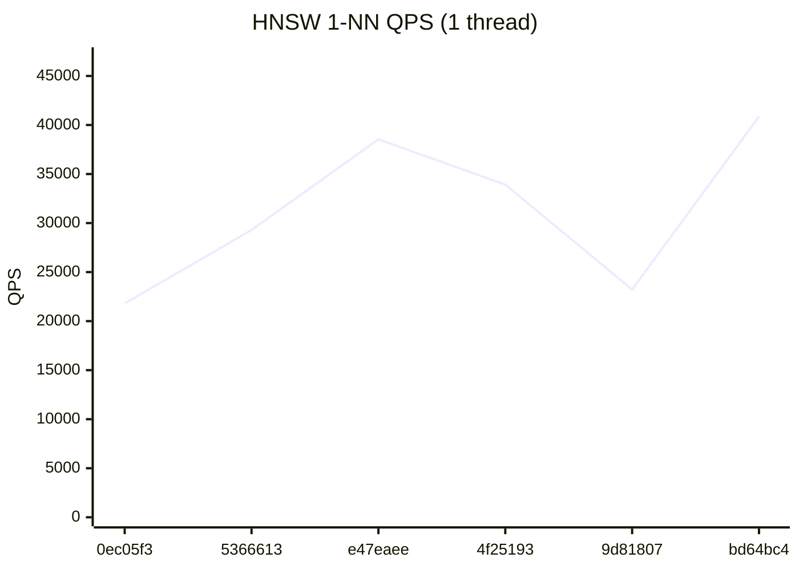
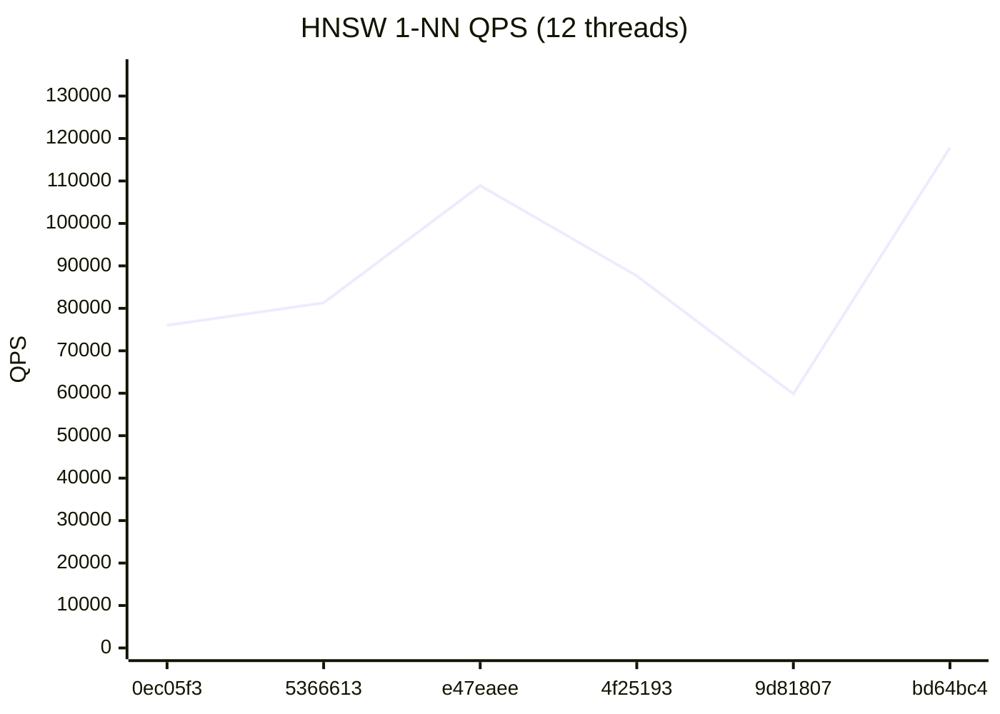
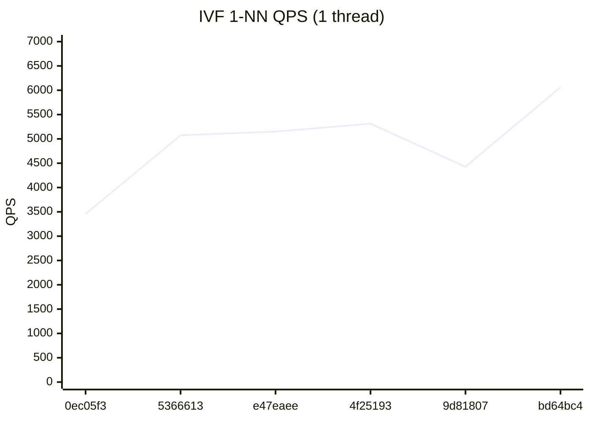
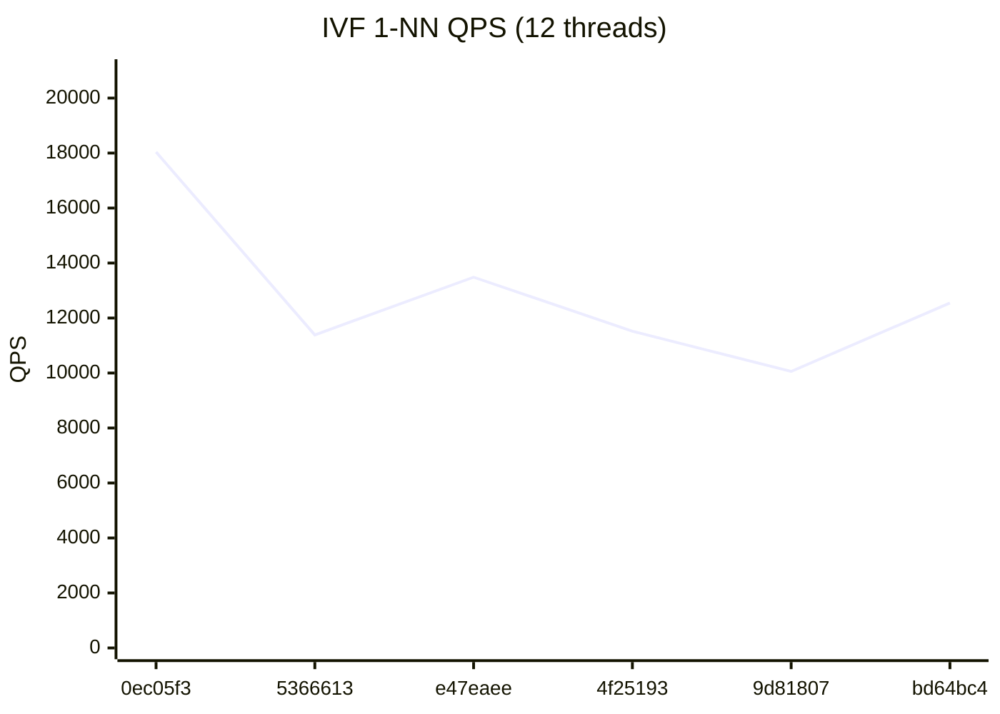

# RedBoxDb Performance Dashboard

> Auto-generated on every commit to main. Last updated: 2026-08-03

## Latest Results (`bd64bc4`)

| Metric | Value | vs Previous |
|--------|-------|-------------|
| HNSW QPS (1T) | 40,861 | +75.9% ↑ |
| HNSW QPS (12T) | 117,830 | +96.9% ↑ |
| IVF QPS (1T) | 6,062 | +36.9% ↑ |
| IVF QPS (12T) | 12,548 | +24.8% ↑ |
| HNSW Insert/sec | 1,984 | +3.8% ↑ |
| IVF Insert/sec | 77,760 | +25.0% ↑ |
| Recall@100 | 86.4% | → |

## HNSW 1-NN QPS (1 thread)


```mermaid
xychart-beta
  title "HNSW 1-NN QPS (1 thread)"
  x-axis ["0ec05f3", "5366613", "e47eaee", "4f25193", "9d81807", "bd64bc4"]
  y-axis "QPS" 0 --> 47000
  line [21803, 29297, 38537, 33923, 23225, 40861]
```

## HNSW 1-NN QPS (12 threads)


```mermaid
xychart-beta
  title "HNSW 1-NN QPS (12 threads)"
  x-axis ["0ec05f3", "5366613", "e47eaee", "4f25193", "9d81807", "bd64bc4"]
  y-axis "QPS" 0 --> 136000
  line [76009, 81296, 108905, 87655, 59834, 117830]
```

## IVF 1-NN QPS (1 thread)


```mermaid
xychart-beta
  title "IVF 1-NN QPS (1 thread)"
  x-axis ["0ec05f3", "5366613", "e47eaee", "4f25193", "9d81807", "bd64bc4"]
  y-axis "QPS" 0 --> 7000
  line [3457, 5074, 5151, 5312, 4427, 6062]
```

## IVF 1-NN QPS (12 threads)


```mermaid
xychart-beta
  title "IVF 1-NN QPS (12 threads)"
  x-axis ["0ec05f3", "5366613", "e47eaee", "4f25193", "9d81807", "bd64bc4"]
  y-axis "QPS" 0 --> 21000
  line [18039, 11386, 13485, 11521, 10058, 12548]
```

## Quick Trends

```
         HNSW QPS (1T)        40,861  ▁▄█▆▁█
        HNSW QPS (12T)       117,830  ▃▃▇▄▁█
          IVF QPS (1T)         6,062  ▁▅▆▆▃█
         IVF QPS (12T)        12,548  █▂▄▂▁▃
       HNSW Insert/sec         1,984  ▁▅▇▆██
        IVF Insert/sec        77,760  ▁▄█▄▃█
            Recall@100         86.4%  ▁▅█▇▇▅
```

## Full History

| # | Commit | Date | HNSW 1T | HNSW NT | IVF 1T | IVF NT | HNSW Ins | IVF Ins | Recall |
|---|--------|------|---------|---------|--------|--------|----------|---------|--------|
| 6 | `bd64bc4` | 2026-08-03 | 40,861 | 117,830 | 6,062 | 12,548 | 1,984 | 77,760 | 86.4% |
| 5 | `9d81807` | 2026-07-26 | 23,225 | 59,834 | 4,427 | 10,058 | 1,912 | 62,217 | 86.7% |
| 4 | `4f25193` | 2026-07-24 | 33,923 | 87,655 | 5,312 | 11,521 | 1,704 | 64,542 | 86.6% |
| 3 | `e47eaee` | 2026-07-23 | 38,537 | 108,905 | 5,151 | 13,485 | 1,873 | 77,904 | 86.9% |
| 2 | `5366613` | 2026-07-22 | 29,297 | 81,296 | 5,074 | 11,386 | 1,687 | 64,329 | 86.3% |
| 1 | `0ec05f3` | 2026-07-21 | 21,803 | 76,009 | 3,457 | 18,039 | 1,219 | 54,340 | 85.7% |
